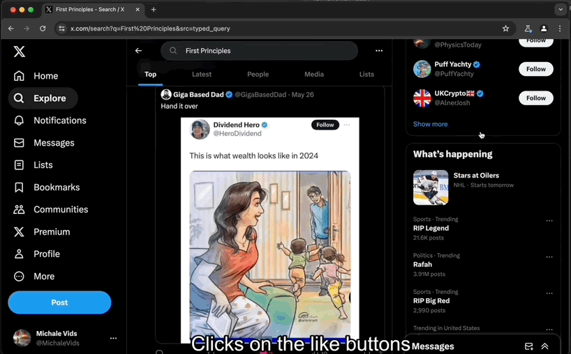

Previously we saw how to [post a thread on Twitter/X using Playwright](/blog/thread-using-playwright).
One of the tweets in the [thread got a like](https://x.com/MichaleVids/status/1794808439975358935).
It gave me the idea of looking for tweets to like. That will increase the account visibility and it might gain some followers.

Since the thread is about a mental model, I thought I could search for the mental model and like tweets in the results.
I'm happy to share that the code worked on the first try 😄. I'm not bragging. It just makes me happy to feel more familiar with Playwright.



To like tweets on the search result I made the script follow these steps:

- Go to x.com
- Click on Explore
- Click on the search input
- Type the name of the mental model (e.g. `First Principles`)
- Press Enter
- Scroll down looking for Like buttons
- Click on a random number of Like buttons.

Pretty straight forward as you can see in the code below

```ts
export async function likeFromExplore(query: string) {
  const { page, close } = await getAuthenticatedPage();

  await goExplore(page);
  await executeSearch(page, query);
  await likePosts(page);
  // ...
}

```

The only part that was not so simple was clicking enough Like buttons.
Let's say the we decide to like 9 tweets but only 2 are visible.
In that case, we scroll down, like the tweets we can and repeat until we reach desired number of liked tweets.

Here's the snippet

```ts
async function likePosts(page: Page) {
  const postsToLike = r(5, 10);
  let likedPosts = 0;
  while (likedPosts < postsToLike) {
    const likeButtons = page.locator("button[aria-label$='Like']");
    const list = await likeButtons.all();
    for (const button of list) {
      if (likedPosts >= postsToLike) {
        break;
      }
      try {
        await button.click({ timeout: 1000 });
        likedPosts++;
        await page.waitForTimeout(r(600, 900));
      } catch (e) {
        // ignore if not found
      }
    }

    if (list.length < postsToLike - likedPosts) {
      await scrollDown(page);
    }
  }
}
```

### The code

As always, find the code [here](https://github.com/michalevids/playwright-utils/blob/f46c18e148c1aeef720f4000fd85ca40532ccdc8/scripts/twitter/like-from-explore.ts#L15) and a video demo below. Thanks for reading!

import { YouTube } from '@astro-community/astro-embed-youtube';

<YouTube id="0JJrczQMqew" />
