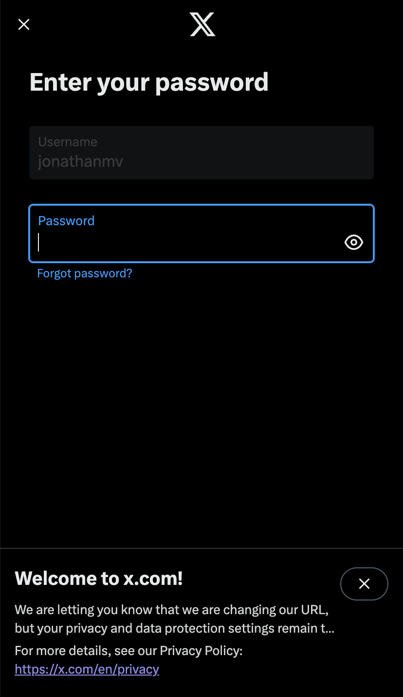
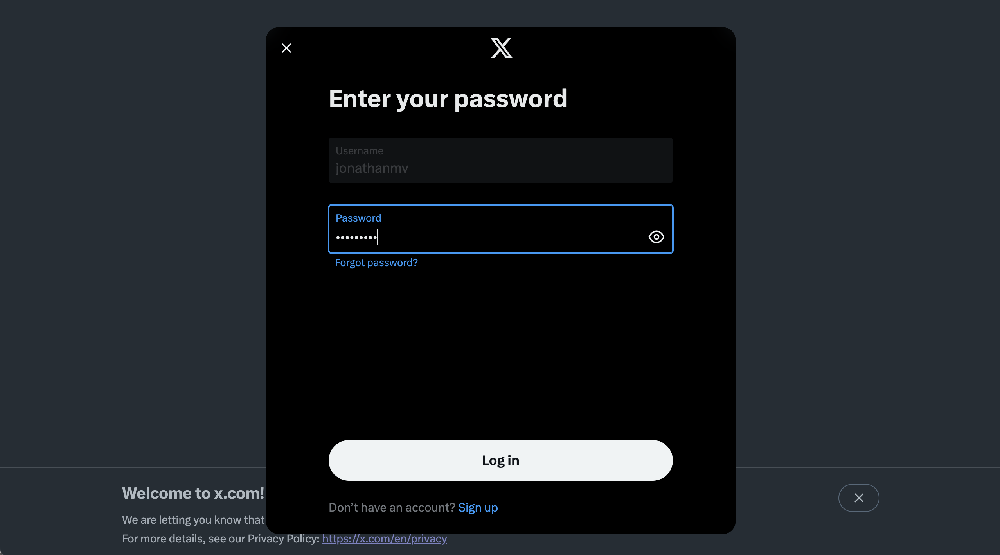
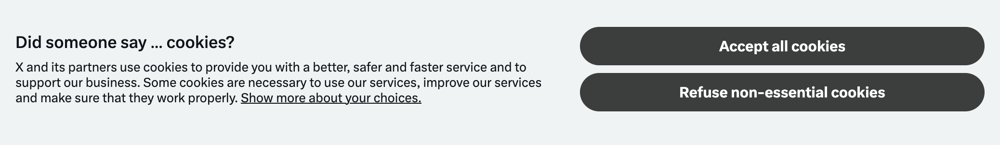

To create content on social media I chose to simulate humans. Instead of trying to use multiple API's I'm using [Playwright](https://playwright.dev/) to login and post on these sites. Here's how I do it for Twitter/X.

## Steps

The code is really simple but I had to overcome a couple of challenges. I'll explain them in each step. The steps were:

- Get a Playwright Page
- Log In
- Post

### Get a Playwrite Page

First, let me share that I never used Playwright before. It has concepts like `browser`, `context` and `page`. The `page` is what we use to navigate to a website and simulate behaviour.

The context represents a state of a browser. For example, if you login in a webiste using one page and then ask the context to give you another page, the new page will have you logged in already, because the context is shared across pages.

A great feature of Playwright is the ability to store a context's state so it can be loaded again later. In our previous example, that means you can save the state after login and close the page and close the context. Then, you can ask the browser for a new context but using the state you stored. When you create a new page you will be logged in already.

Maybe some code helps

```ts
const authFile = "playwright/.auth/twitter.json";
export async function getUnauthenticatedPage() {
  const browser = await chromium.launch({
    timeout: 60000,
    headless: false,
    slowMo: 1000,
  });
  const context = await browser.newContext({
    ...devices["Desktop Chrome"],
  });
  const page = await context.newPage();

  return {
    page,
    close: async () => {
      await page.close();
      await context.close();
      await browser.close();
    },
  };
}
```

In the code above we launch a browser instance, ask it to create a new context and ask the context to create a new page.
Notice that the method is called `getUnauthenticatedPage`. Now, let's see how to log in.

### Log In

Logging in is simple but I struggled a bit getting it to work. Let's look at the code:

```ts
async function doLogin(page: Page, user: string, password: string) {
  await page.goto("https://twitter.com/i/flow/login");

  // type username
  const userInput = '//input[@autocomplete="username"]';
  await page.fill(userInput, user);

  // click next
  await page.click("//span[contains(text(), 'Next')]");

  // type password
  const passwordInput = '//input[@autocomplete="current-password"]';
  await page.fill(passwordInput, password);

  // click login
  await page.click("//span[contains(text(), 'Log in')]");

  // wait for login
  await page.waitForURL("https://x.com/home");
}
```

I found the code on this [TikTok](https://www.tiktok.com/@gnublet/video/7195849224968244523).
Pretty straight forward. It navigates to the login page, fills the username, clicks _Next_, fills the password and clicks _Log In_.

Look at the screenshot below and tell me where the _Log In_ button is.



Hard to see, right? Well, the button is hidden behind the _welcome to x.com_ banner. And since we can't see it, Playwright can't see it either.
I spent several minutes trying to "find" the X to close the banner and reveal the button. I couldn't. Maybe a more experienced Playwright developer would have done it. My solution was to change the device.

```ts
// from
const context = await browser.newContext({
  ...devices["iPhone 11"],
});

// to
const context = await browser.newContext({
  ...devices["Desktop Chrome"],
});
```

This is how it looks



Now that we can see the _Log in_ button, so can Playwright and the login suceeded 🎉.

Now that we are logged in, we can tweet. However, I didn't want to log-in-then-tweet each time I wanted to post something. Twitter/X might perceive it as a weird behaviour and the account could be cancelled or something. So, before tweeting, I stored the context to be reused in future sessions.

```ts
const { page, close } = await getUnauthenticatedPage();

await doLogin(page, user, password);
await page.context().storageState({ path: authFile });
await close();
```

That's it. With our context stored we can proceed to tweeting from another page.

### Tweet

Notice that we logged in used the `getUnauthenticatedPage` method. Since we saved an authenticated context state we can load it to `getAuthenticatedPage`.

```ts
export async function getAuthenticatedPage() {
  // ... Same as getUnauthenticatedPage

  const context = await browser.newContext({
    ...devices["Desktop Chrome"],
    storageState: authFile, // This line is new
  });

  // ... Same as getUnauthenticatedPage
}
```

Above you can see where we load the saved context state. With it, we create a new page which is logged in and we can post a tweet.

```ts
async function postTweet(page: Page, text: string) {
  // open twitter
  await page.goto("https://x.com/home");

  // click away the cookie banner
  await page.click("//span[contains(text(), 'Refuse non-essential cookies')]");

  // click tweet
  await page.click("a[href='/compose/post']");

  // type tweet
  await page.fill(
    "//div[@data-viewportview='true']//div[@class='DraftEditor-editorContainer']/div[@role='textbox']",
    text
  );

  // click post
  await page.click("//span[contains(text(), 'Post')]");

  // wait for tweet
  await page.waitForURL("https://x.com/home");
  await page.waitForTimeout(r(1000, 2500));

  await simulateRandomBehaviour(page);
}
```

Again, pretty straight forward. Go to [x.com](https://x.com), click on the cookie banner, click on post, type the message and click on post.
If you read the code carefully, you will notice a _click on the cookie banner_ step. That was an addition to the code I used as reference. Since I am in Europe, I get prompted with a banner to accept/reject cookies. It was a small obstacle but easier to overcome. I just found the right button and clicked the banner away.

.

That's it folks! A bonus piece of code: Random scrolling :)

```ts
async function simulateRandomBehaviour(page: Page) {
  // simulate scrolling
  const times = r(2, 5);
  for (let i = 0; i < times; i++) {
    await page.mouse.wheel(0, r(100, 500));
    await page.waitForTimeout(r(1000, 2500));
  }
}
```

The `r` function you see there just gets a random integer within the range.

### The code

Find the code [here](https://github.com/michalevids/playwright-utils) and a video demo below. Thanks for reading!

import { YouTube } from '@astro-community/astro-embed-youtube';

<YouTube id="2-sWWX19vWU" />